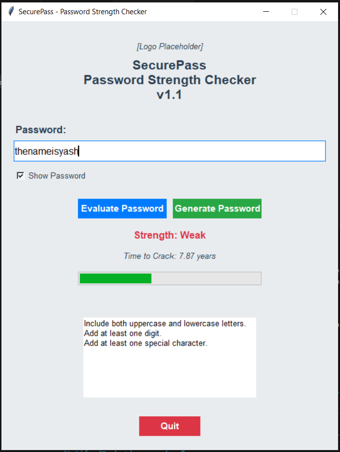
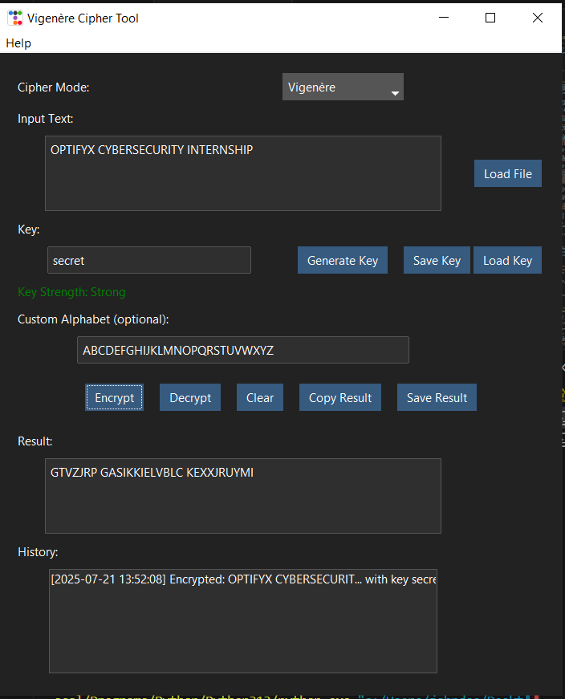
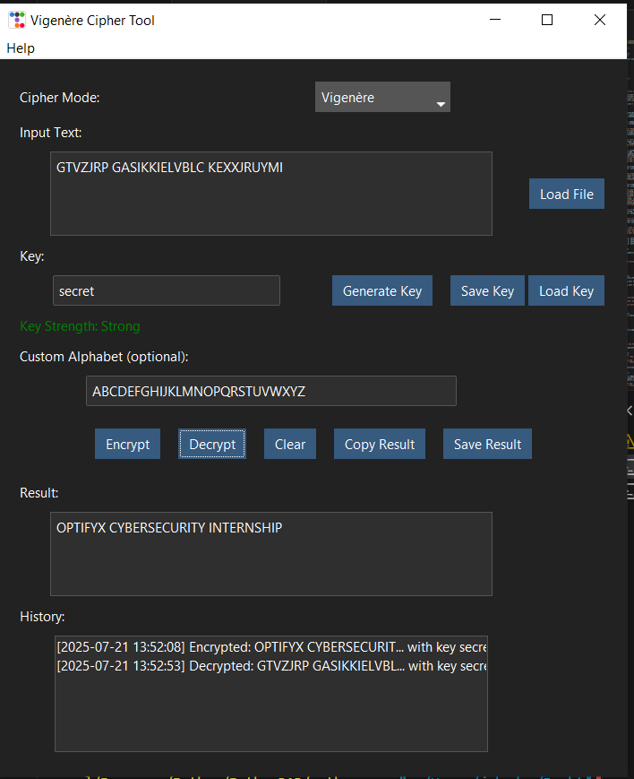
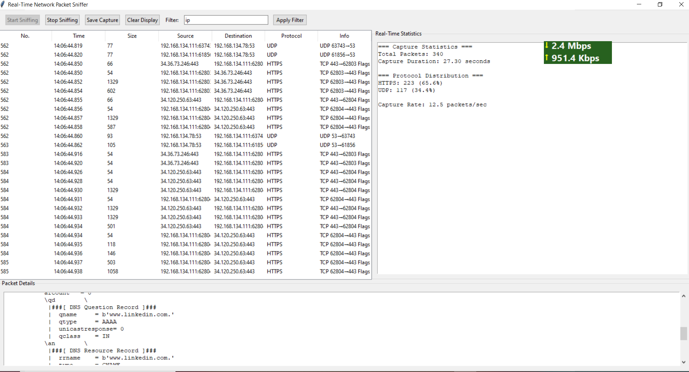
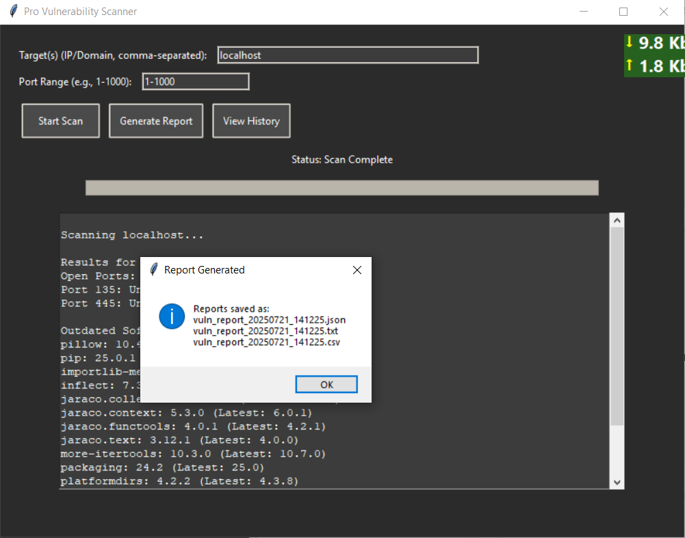
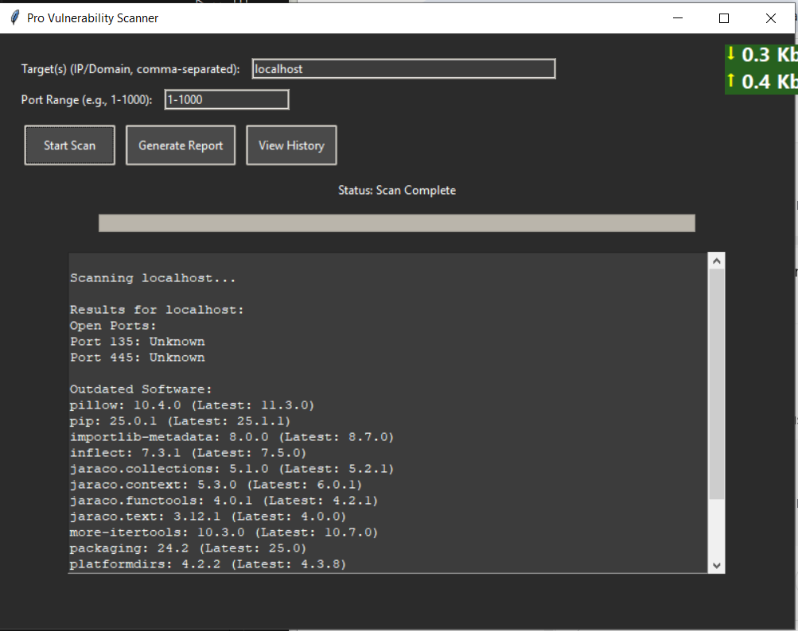
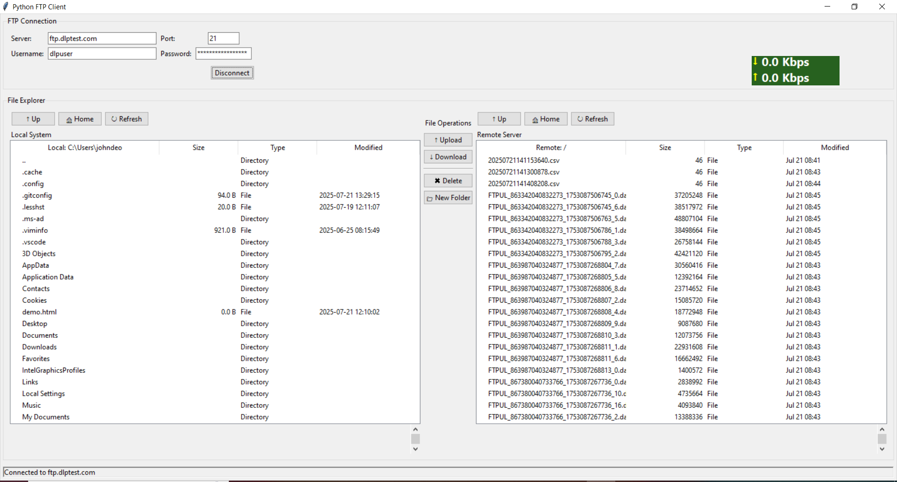

# 🔐 OPTIFYX CYBERSECURITY INTERNSHIP

Welcome to my repository for the **Cybersecurity Internship** by [Optifyx Technology](https://optifyx-technology.netlify.app/).  
This internship emphasizes hands-on experience in practical cybersecurity domains such as scanning, detection, encryption, and secure file transfer.

---

## 📚 Internship Structure

To complete the internship, each participant must:
- ✅ Complete **any 2 tasks** from the list below
- 🎥 Upload video explanations on **LinkedIn** and tag **@OptifyxTechnology**
- 🗂 Submit all tasks via the official **Task Submission Form**
- 💬 Comment on **2 peers' videos** for peer review
- 📁 Create a GitHub repository named `OPTIFY` with submitted code

---

## 🧠 Tasks Overview

### 🔰 Level 1 Tasks

#### ✅ Task 1: Password Strength Checker
Create a program to evaluate password strength based on:
- Length
- Uppercase/lowercase characters
- Digits and special characters

📁 Code: [`Task 1 - password_checker.py`](./Task%201/password.py)

---

#### ✅ Task 2: Basic Encryption and Decryption
Implement encryption/decryption using:
- Caesar Cipher or
- Vigenère Cipher

📁 Code: [`Task 2 - encryption_tool.py`](./Task%202/cipher_tool.py)

---

### 🛡️ Level 2 Tasks

#### ✅ Task 1: Network Packet Sniffer
Build a tool to capture and analyze packets:
- Protocol, source/destination IPs, port info, and size

📁 Code: [`Task 3 - packet_sniffer.py`](./Task%203/sniffer_3.py)

---

#### ✅ Task 2: Vulnerability Scanner
Create a scanner to detect:
- Open ports
- Outdated software
- Export a structured report (JSON/CSV)

📁 Code: [`Task 4 - vulnerability_scanner.py`](./Task%204/vul_scanner.py)

---

### 🔐 Level 3 Tasks

#### ✅ Task 1: Secure File Transfer Protocol (SFTP) Client
A Python SFTP client using `paramiko` and `tkinter`:
- Upload / download files securely
- List remote directory contents

📁 Code: [`Task 5 - sftp_client_gui.py`](./Task%205/ftp_client.py)

---

#### ✅ Task 2: Intrusion Detection System (IDS)
Build an IDS using:
- Pattern matching
- Anomaly detection (e.g., Isolation Forest)
- Live alerts + traffic logs

📁 Code: [`Task 6 - IDS.py`](./Task%206/IDS.py)

---

## 🧰 Technologies Used

- **Python 3.13**
- Libraries: `paramiko`, `nmap`, `scapy`, `socket`, `tkinter`, `numpy`, `sklearn`, `pandas`, `netifaces`
- Report formats: `.txt`, `.json`, `.csv`
- Optional GUI with Tkinter

---

## 📤 Submission Checklist

- [x] ✅ Completed 2 or more tasks
- [x] 📹 Video explanations uploaded to LinkedIn with tag `@OptifyxTechnology`
- [x] 💬 Commented on 2 peers' LinkedIn task posts
- [x] 📁 GitHub repository (`OPTIFY`) created
- [x] 📩 Submitted Task Form

---

## 📸 Screenshots / Demo

### 🔐 Task 1 – Password Strength Checker

---

### 🔐 Task 2 – Encryption and Decryption

---

### 🌐 Task 3 – Network Packet Sniffer

---

### 🛡️ Task 4 – Vulnerability Scanner

---

### 🔐 Task 5 – SFTP Client GUI

## 👨‍💻 About Me

**Name:** YASH DOIFODE
**LinkedIn:** [[linkedin.com/in/your-profile](https://www.linkedin.com/in/yash-doifode-a88a62238/)]([https://linkedin.com/in/your-profile](https://www.linkedin.com/in/yash-doifode-a88a62238/))  
**Email:** yashdoifode1439@gmail.com  

---

## 📜 Acknowledgements

Grateful to **Optifyx Technology** for this learning-rich internship opportunity that helped build real-world cybersecurity skills through guided and practical tasks.

---

